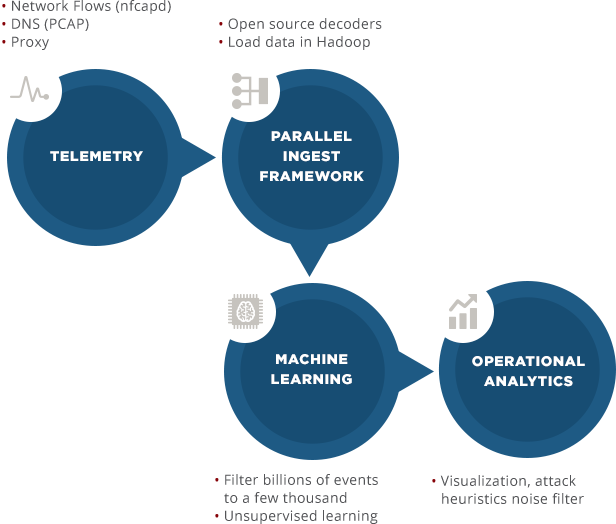
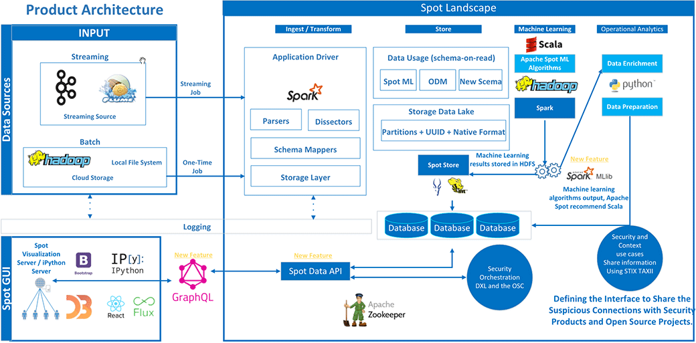
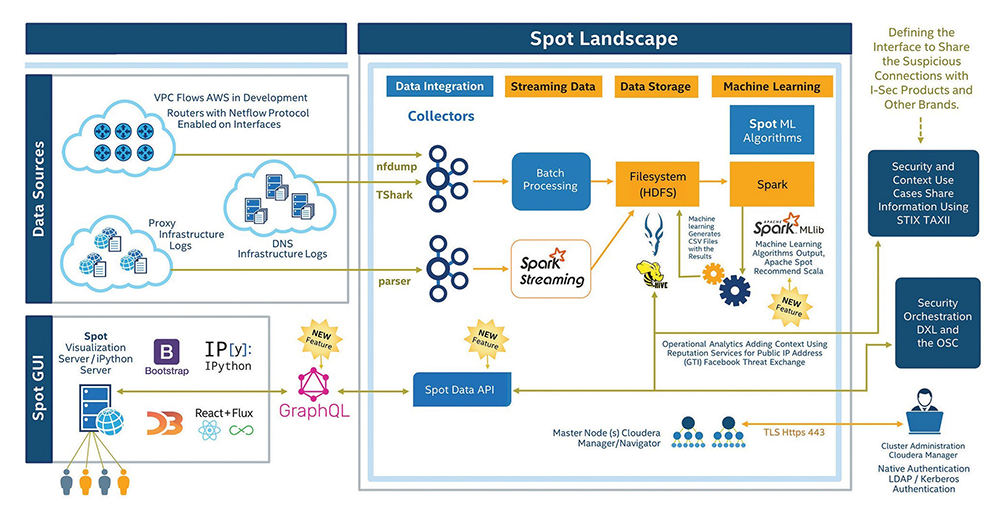

## 0x00 Origin

公司IDS产品一直使用基于特征的规则来检测网络攻击，用户使用下来的感受是检测出来的攻击，都是已知的网络攻击，那么能不能检测一些未知的攻击？例如APT。**身为工程师怎么能说不行呢？** 于是着手了解相关的技术。经过搜索了解，Apache Spot便进入视线范围了。

一番操作下来，发现介绍Apache Spot资料并不多，大陆的主要有参考[4]，其余的资料还是以Apache Spot官方网站资料和github为主。

首先介绍一下Apache Spot是什么，再说明一下Apache Spot的产生背景，然后描述一下Apache Spot怎么样，最后描述一下Apache Spot这个开源方案的结构，并说明其作用。

## 0x01 What Spot

Apache Spot官网描述如下：

> Apache Spot is a community-driven cybersecurity project, built from the ground up, to bring advanced analytics to all IT Telemetry data on an open, scalable platform. It is an open source software for leveraging insights from flow and packet analysis. Spot expedites threat detection, investigation, and remediation via machine learning and consolidates all enterprise security data into a comprehensive IT telemetry hub based on open data models. Spot’s scalability and machine learning capabilities support an ecosystem of ML-based applications that can run simultaneously on a single, shared, enriched data set to provide organizations with maximum analytic flexibility

Apache Spot github描述如下：

> Apache Spot is open source software for leveraging insights from flow and packet analysis. It helps enterprises and service providers gain insight on their computing environments through transparency of service delivery and identification of potential security threats or attacks happening among resources operating at cloud scale.

Apache Spot Blog的描述如下：
> What Is Apache Spot? 
>> Apache Spot is an open source, flow and packet analytics solution built on Hadoop. It combines big data processing, at-scale machine learning, and unique security analytics to put potential threats in front of defenders.

根据上述三者的描述，可以把Apache Spot理解为：

**Apache Spot是一个基于流分析和包分析的，开源的网络安全监控方案。它使用Machine Learning技术，结合企业已有的安全信息，帮助检测、研究和修复网络威胁。它是一个开放、可伸缩的云计算安全方案。**

## 0x02 Backgroud

参考[5]中，对于项目起源的描述如下：

> While I am a data scientist today, I was a security investigator just a few years ago. I wanted to develop a solution that would put new tools and technology in play for defenders, but without requiring them to walk away from security and get a math degree.
> 
> We wanted to start with the hard problems, so we looked at the emerging need to analyze data that was produced at a scale outside what a lot of security solutions could handle. The data is being created today, and lack of visibility into that data gives attackers a profound advantage. Also, in this new era of security, many defenders (public and private sector) have to answer to their citizens and customers when these threats occur. In other words, an event that says “this attack was blocked” is insufficient; an organization needs to see what happened before, during, and after a particular machine was attacked at a particular time. The problem is summarized in a slide from a FloCon talk.
> 
> The gist is that while processing is a challenge at higher scales, the amount of insight gained is higher when analyzing flows and packets from key protocols (like DNS). And that’s how we got here.

总结起来就是：Apache Spot项目创建的背景是网络安全数据分析中，出现了超出传统安全方案处理能力的分析需求。并帮助回答“攻击前发生了什么？”，“攻击中发生了什么？”，“攻击之后发生了什么”等重要的问题，从而可以描绘出一个攻击发生前后的完整场景（这个就厉害了，就不知道是否能真的做到 :-) :-) ）。

注意：Apache Spot的前身是Open Network Insight，见参考[6]。

## 0x03 How Spot

### 0x0300 Spot Function

根据官网对于Spot优点的描述（下图），在提供了不同类型的数据后，Spot可以提供的功能有：

> **仅有外部流量(perimeter flows)**
> 
> * 隐蔽扫描识别(Stealthy Scanning)
> * 侧信道攻击检测(Side-Channel Data Escapes)
> * 反射攻击检测(Reflection Attacks)
> * 异常数据流检测(Unusual Data Flows)
> * 信标检测(Beaconing)

增加了DNS数据后，可提供的功能有：

> **外部流量 + DNS**
> 
> * DNS隧道检测(DNS Tunneling)
> * DNS隐蔽信道识别(Convert DNS Channels)
> * 内部DNS探测(Internal DNS Recon)

增加proxy数据后，可提供的功能有：

> **外部流量+ DNS + Proxy**
> 
> * 跨站脚本攻击检测(Cross site scripting(XSS))
> * C&C主机发现(Command and Control)
> * URL混淆检测(URL obfuscation)
> * 异常的POST数据发现(Unusual Data POSTs)

增加internal flows数据后，可以提供的功能有：

> **外部流量+ DNS + Proxy + 内部流量**
> 
> * 横向移动检测(Lateral Movement)
> * 完整的威胁可见性(Complete Threat Visibility)

了解下来后，个人的看法是：Spot本身不能提供这些威胁类型的检测，需要结合威胁情报信息，例如McAfee的“GTI”服务，才能具体的检测出威胁类型。

### 0x0301 How Work

根据上面官方提供的流程图，可以看出：

Apache Spot使用机器学习模块作为过滤器，在流量中区分出恶意流量，通过网络流量来描述网络实体的行为。使用常用的上下文增强技术、噪声过滤、白名单以及启发式技术，来发现网络威胁。

### 0x0302 Key Feature

根据官网中的描述，共计有6个关键特性：

1. **可疑DNS包检测**(Suspicious DNS packets)：Spot对于DNS流量使用深度包检测（DPI）技术，对DNS流量进行画像，经过可视化、正则化以及模式匹配处理，向安全分析师呈现出DNS流量数据中最有可能是威胁的部分。*由spot-oa模块实现，利用“GTI”进行DNS可疑流量的检测、判定。McAfee的GTI服务是要收费的，收费的，收费的。重要的事情说三遍。*
2. **威胁应急响应**（Threat Incident and Response）：给定一个IP地址，Spot能够将该IP相关的所有数据按时间序列整合在一起，形成这个IP网络实体的“社交网络(social network)”。*由spot-oa模块提供此功能，但项目提供的oa功能还是很弱的，真要在商用产品中使用，是需要进一步开发的。*
3. **可疑连接发现**（Suspicious Connects）：通过机器学习的方法对在网络上进行通信的机器及其通信模式建立相应的模型，经过一系列处理后，这些剩余的数据就是最有可能是威胁的部分。*由spot-ml模块提供此功能，可以认为此模块是Spot项目的核心模块吧，提供了无监督的机器学习算法，来帮助安全人员分析可疑的流量。*
4. **故事板（Storyboard）**：安全分析师对威胁事件完成调查后，可以通过故事板去表现事件的来龙去脉，也就是说在故事板中，我们可以了解到攻击者是什么时候攻入系统的？都拿下了哪些机器？怎么拿下的？*这个，就是吹。*
5. **开放数据模型**（Open Data Models）：为了让威胁检测模型的开发过程更加简单高效，保证个人、企业、社区输出的检测模型的兼容性，Apache Spot 对网络、终端、用户等相关数据进行了标准化定义，规范了这些数据在逻辑层以及物理层的形态。简而言之，开放数据模型保障了不同的开发者在用同一种“语言”在进行威胁检测模型的开发。*这个模型保证了Spot可以使用多种数据源，但根据了解到的信息来看，还是需要进一步开发的。*
6. **协作**（Collaboration）：Apache Spot 平台运行于Hadoop大数据平台之上，通过其定义的开放数据模型，使得个人、企业、社区开发者的产出可以无缝衔接。正如攻击者可以利用其它攻击者制作的攻击工具一样，防护方也能够使用其它防护者制作的防护工具。*没说的，空话。*

## 0x04 Spot Architecture

从Apache Spot的github页面中，可以清晰看出其是由三大模块组成，分别是：采集模块(spot-ingest)，机器学习模块(spot-ml)，运营分析模块(spot-oa)。此外，项目中还有一个单独的安装模块（spot-setup），帮助安装Spot。

官网提供的Spot系统架构图如下：

* **采集模块：** 在上图中就是“Ingest/Transform”部分。采集模块可以接受的数据输入由三种类型：Flows，DNS (pcaps)，Proxy。其中的Flows类型主要是网络采样数据，例如Netflow，sFlow等；DNS类型的数据就是pcap格式的离线dns数据包文件；Proxy类型的数据是某些代理服务器产生的代理日志文件。
* **存储模块：** 在上图中就是“store”部分。Apache Spot直接使用Hadoop作为其存储设施，所以没有单独的存储模块。好处是存储容量可以随便扩展；坏处是Hadoop集群贵啊。 
* **机器学习模块：** 在上图中就是“Machine Learning”部分。Apache Spot中使用的是Scala语言开发的，使用Spark作为计算引擎。
* **运营分析模块：** 在上图中就是“Operational Analytics”部分。此部分才是用户真正关心的部分，用于展示网络威胁情况，判定网络威胁类型等等。项目自带的spot-oa模块，是很弱的。

官方还提供另一个结构图，此图侧重于项目中的数据如何流动，区别不大；不做说明。详情如下图：

## 0x06 Similary Project

**Apache Metron：** 下次聊。

## Reference

1. [Apache Spot](http://spot.incubator.apache.org/)
2. [Open Network Insight](https://github.com/Open-Network-Insight/open-network-insight)
3. [Apache/incubator-spot](https://github.com/apache/incubator-spot)
4. [开源流量分析系统 Apache Spot 概述](http://blog.nsfocus.net/apache-spot/)
5. [Apache Spot (Incubating): Three Most-Asked Questions](https://spot.incubator.apache.org/blog/apache-spot-3-most-asked-questions/)
6. [Open Network Insight](https://github.com/Open-Network-Insight/open-network-insight)
7. [Architecture](http://spot.incubator.apache.org/get-started/architecture/)
8. [Apache Spot Product Architecture Overview](http://spot.incubator.apache.org/blog/apache-spot-product-architecture-overview/)
9. [Apache Metron](https://github.com/apache/metron)
